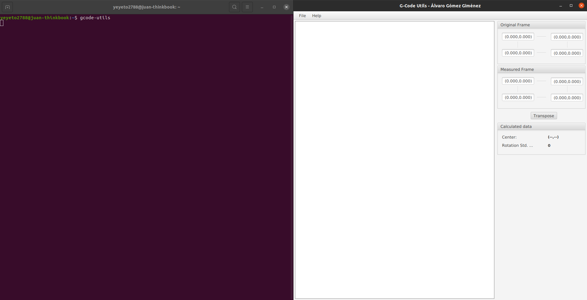
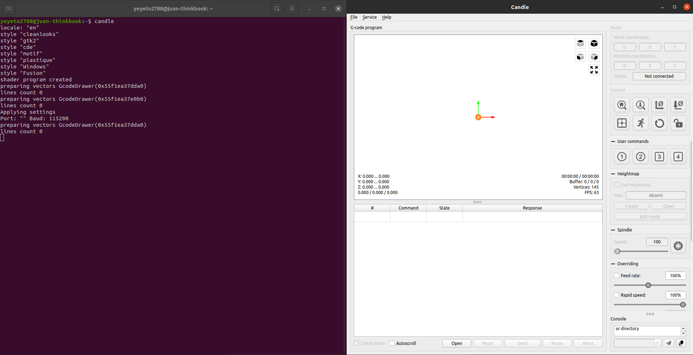
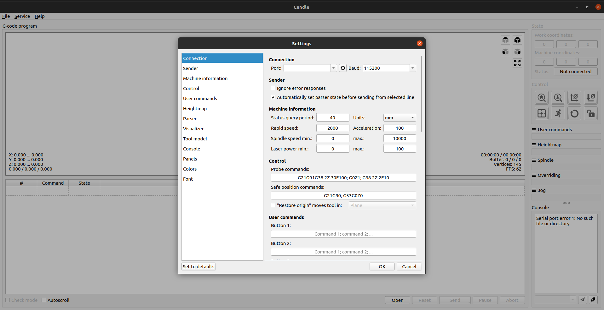

# CNC Setup

This repository contains an Ansible playbook for installing CNC related tools on Ubuntu 20.04 based systems. Those tools are:

- Candle
- g-code-utils
- FlatCAM

---

- [CNC Setup](#cnc-setup)
  - [Tools / Applications installed](#tools--applications-installed)
    - [g-code-utils](#g-code-utils)
    - [Candle](#candle)
    - [FlatCAM](#flatcam)
  - [Executing this ansible playbook.](#executing-this-ansible-playbook)

---

## Tools / Applications installed

### [g-code-utils](https://github.com/alvarogimenez/g-code-utils)

Application from [alvarogimenez](https://github.com/alvarogimenez).

Used for double side PCB making, this Java application will let you turn the board and align it on your cnc with the already generated Gcode.



**NOTES**:
* In ubuntu 20.04 systems the OpenJDK does not come with JavaFX installed anymore which is needed to execute the application. So there is a need to install it and it is done automatically for us with this tool/script.

### [Candle](https://github.com/Denvi/Candle)

Application from [Denvi](https://github.com/Denvi).

Send the Gcode to the board. Similar to the universal Gcode sender.



**NOTES**:

- On first spin up we need to set setting to default as when it is built default values are not taken. So in order to do it we need to go to `Service` > `settings` > `Set to defaults` as shown in the picture below.
  

### [FlatCAM](http://flatcam.org/)

Application from [jpcgt]() & [Marius Stanciu]().

Gerber to PCB conversion.

**NOTES:**

- I had to switch to the `Beta` branch as `master` was somehow not working on 20.04 Ubuntu based systems, seems to be using old libraries and still pointing to the dead Python 2.7
- I had an issue also with 2 libraries:
  - `vispy` which I had to downgrade to `0.7.0`
  - `svglib` by default does not have any version pinned to it so downgrading to `1.1.0` made it work.
  - Installed packages as per 04/Feb/2022 are listed [here.](./docs/04_02_2022_python3_packages.txt)


## Executing this ansible playbook.

- ### **Automated script installation. :racing_car:**

  ```shell
  wget -q -O - https://raw.githubusercontent.com/yeyeto2788/cnc_setup/main/setup_cnc.sh | bash
  ```

- ### **Execution via `ansible-pull` :metal:**

  ```shell
  ansible-pull -K --url https://github.com/yeyeto2788/cnc_setup.git main.yaml
  ```

- ### **Manual execution. :cry:**

  ```shell
  git clone https://github.com/yeyeto2788/cnc_setup.git
  cd cnc_setup
  ansible-playbook main.yaml -K -u $USER
  ```
