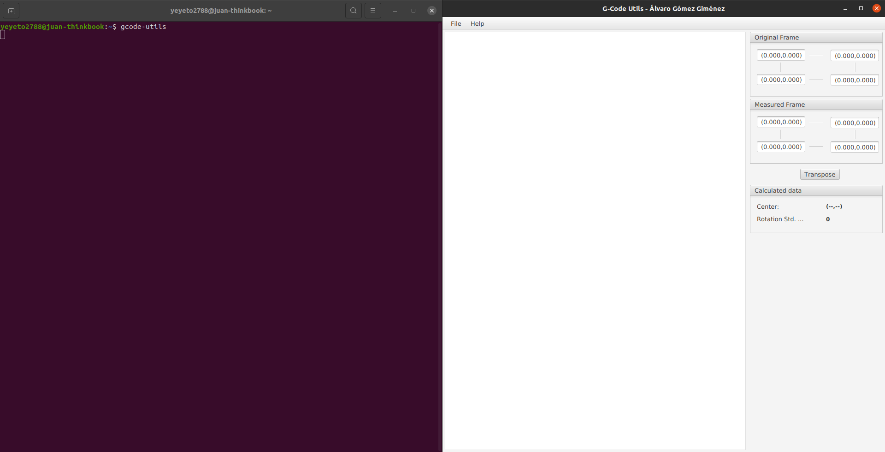
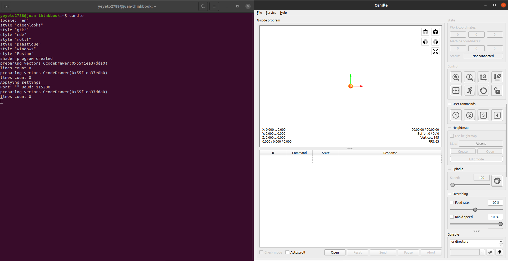
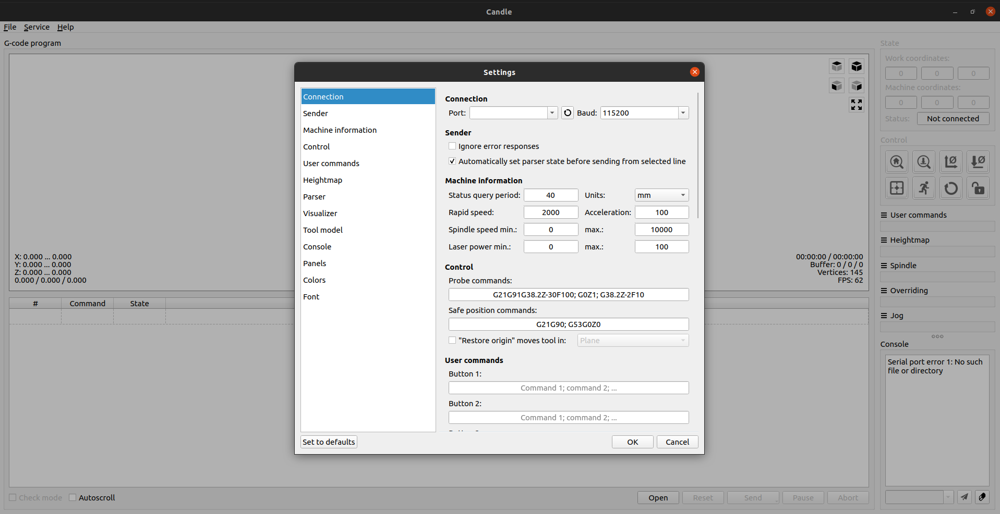
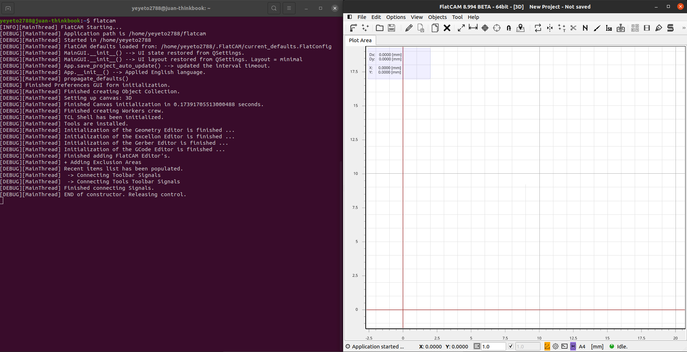
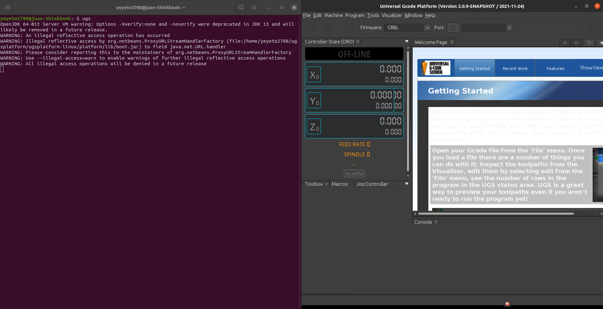

# CNC Setup

This repository contains an Ansible playbook for installing CNC related tools on Debian 12 (bookworm) / Ubuntu 22.04 LTS or newer based systems (x86_64 or aarch64, e.g. Raspberry Pi OS).

**Recommended minimum:** 8 GB RAM. No individual tool here publishes an official spec for the whole stack — this figure comes from Kiri:Moto's own guidance, since it's the heaviest single component (all slicing runs client-side in its bundled Chromium/Electron process). The rest of the toolset (Candle, FlatCAM, UGS, g-code-utils, F-Engrave) is comfortable with far less; see [Minimum requirements](#minimum-requirements) for the per-tool breakdown.

Those tools are:

- Candle
- g-code-utils
- FlatCAM
- Universal Gcode Sender
- F-Engrave
- Kiri:Moto

---

- [CNC Setup](#cnc-setup)
  - [Tools / Applications installed](#tools--applications-installed)
    - [g-code-utils](#g-code-utils)
    - [Candle](#candle)
    - [FlatCAM](#flatcam)
    - [Universal Gcode Sender](#universal-gcode-sender)
    - [F-Engrave](#f-engrave)
    - [Kiri:Moto](#kirimoto)
  - [Minimum requirements](#minimum-requirements)
  - [Executing this ansible playbook.](#executing-this-ansible-playbook)

---

## Tools / Applications installed

### [g-code-utils](https://github.com/alvarogimenez/g-code-utils)

Application from [alvarogimenez](https://github.com/alvarogimenez).

Used for double side PCB making, this Java application will let you turn the board and align it on your cnc with the already generated Gcode.



**NOTES**:

- The OpenJDK on modern Debian/Ubuntu does not come with JavaFX anymore, which is needed to execute the application. It is downloaded and wired up automatically for us with this tool/script.
- The release jar was renamed from `g-code-utils-<version>.jar` to `g-code-utils-assembly-<version>.jar` starting with v1.1.x.

### [Candle](https://github.com/Denvi/Candle)

Application from [Denvi](https://github.com/Denvi).

Send the Gcode to the board. Similar to the universal Gcode sender.



**NOTES**:

- As of v11, Candle switched its build system from `qmake` to `CMake` and its old `grbl_1_1` branch (previously used here) no longer exists, so the playbook now builds a pinned release tag (`candle_version`) with CMake instead.
- `qt5-default` was removed from Debian bookworm and Ubuntu 21.04+, so the individual `qtbase5-dev`/`qt5-qmake`/`qtchooser` packages are installed instead.
- The current build also links against `qtwebengine5-dev` (bundles a Chromium engine), which is a noticeably larger download/build than the old Qt Widgets-only version — expect it to take longer and use more disk space.
- On first spin up we need to set setting to default as when it is built default values are not taken. So in order to do it we need to go to `Service` > `settings` > `Set to defaults` as shown in the picture below.
  

### [FlatCAM](http://flatcam.org/)

Application from [jpcgt]() & [Marius Stanciu]().

Gerber to PCB conversion.



**NOTES:**

- The original `jpcgt/flatcam` repository is unmaintained (its own docs still target the dead Python 2.7), so this playbook now clones the actively maintained **FlatCAM Evo** fork instead, from `bitbucket.org/marius_stanciu/flatcam_beta` (still the `Beta` branch).
- FlatCAM Evo requires **Python 3.6+ and PyQt6** (the original used PyQt5); packages and pip dependencies were updated to match its own `setup_ubuntu.sh`.
- Historical note (no longer needed with Evo): earlier versions required pinning `vispy==0.7.0` and `svglib==1.1.0` to work around broken releases; installed packages as per 04/Feb/2022 are listed [here](./docs/04_02_2022_python3_packages.txt) for reference.

### [Universal Gcode Sender](https://github.com/winder/Universal-G-Code-Sender)

Application from [winder](https://github.com/winder)

Send gcode to controller boards, similar to Candle.



**NOTES:**

- As of the 2.1.x releases, UGS publishes a self-contained `.deb` package (bundling its own JRE — it only depends on `libc6`) instead of a tar.gz fetched from a JFrog Artifactory instance, and the old lightweight "classic" build is no longer published. This playbook now downloads and installs that `.deb` directly with `apt`.
- The `.deb` is architecture-specific (`x64`/`aarch64`); the playbook picks the right one from `ansible_architecture` via the `ugs_arch_map` variable.

### [F-Engrave](https://www.scorchworks.com/Fengrave/fengrave.html)

Application from [Scorch Works](https://www.scorchworks.com/).

Converts text and DXF/image files into V-carve/engraving Gcode.

**NOTES**:

- Built from source, the `TTF2CXF_STREAM` helper is compiled and installed to `/usr/local/bin` so TrueType fonts can be used.
- `potrace` is installed to allow importing PBM images.
- Configure font locations through `Settings > General Settings` and save the settings to `~/.fengraverc` so they persist between runs.

### [Kiri:Moto](https://grid.space/kiri/)

Application from [Grid.Space](https://github.com/GridSpace).

Slicer for 3D printing, CAM and laser cutting, downloaded here as the Linux AppImage release.

**NOTES**:

- Requires `libfuse2` to run the AppImage, which is installed automatically. On **Ubuntu 24.04** this package was renamed to `libfuse2t64`; if you're on 24.04 override `kirimoto` packaging in `variables.yaml` accordingly (do **not** `apt install fuse`, which can remove `fuse3` and break the system).
- Launched with the `--no-sandbox` flag as required for AppImages run as root/via sudo-less Electron on some distros.

## Minimum requirements

None of these projects publish a formal hardware spec sheet, so treat the below as practical guidance gathered from upstream docs/issues rather than guaranteed minimums:

| Tool | OS / Python / Java | Notes |
| --- | --- | --- |
| Candle | Debian 12 / Ubuntu 22.04+ | CMake build now links Qt WebEngine (bundled Chromium) — budget extra disk space and build time versus the old Qt Widgets build. No official RAM minimum published. |
| g-code-utils | Java 11+ (`default-jre`) | Needs a separately downloaded OpenJFX SDK since JavaFX isn't bundled with modern OpenJDK. |
| FlatCAM (Evo) | Python 3.6+, PyQt6 | No official RAM minimum published; large Gerber/PCB jobs will want more RAM/CPU headroom in practice. |
| Universal Gcode Sender | none (self-contained `.deb`, only needs `libc6`) | Building from source upstream currently targets Java 25, but the packaged `.deb` bundles its own runtime so end users don't need a JDK installed. |
| F-Engrave | Python 3 + Tkinter | Lightweight; no significant resource requirements. |
| Kiri:Moto | 8 GB+ RAM recommended | All slicing runs client-side in the bundled Chromium/Electron process; a modern WebGL-capable GPU driver helps. |

## Executing this ansible playbook.

- ### **Automated script installation. :racing_car:**

  ```shell
  wget -q -O - https://raw.githubusercontent.com/yeyeto2788/cnc_setup/main/setup_cnc.sh | bash
  ```

- ### **Execution via `ansible-pull` :metal:**

  ```shell
  ansible-pull -K --url https://github.com/yeyeto2788/cnc_setup.git main.yaml
  ```

- ### **Manual execution. :cry:**

  ```shell
  git clone https://github.com/yeyeto2788/cnc_setup.git
  cd cnc_setup
  ansible-playbook main.yaml -K -u $USER
  ```
